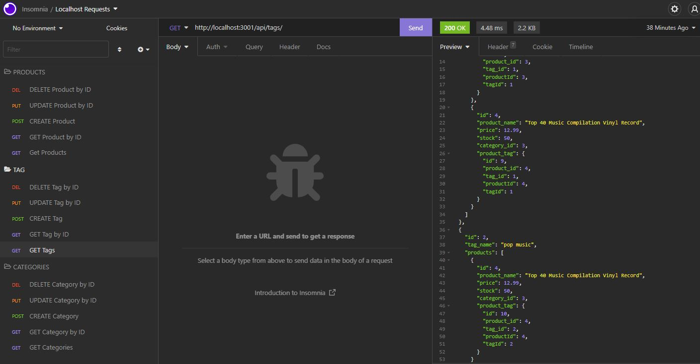

# ORM_E-CommerceBackEnd
  

  ## Description
  
  - This is my first homework assignment using a Node.js Object-Relational Mapping (ORM) library for the Full Stack Web Developer course I'm enrolled in. The assigment was to build the back end for an e-commerce site by modifying starter code.
  - By completing this assignment, I was able to implement lessons from my course, including:
    - Configure a working Express.js API
    - Use Sequelize ORM to interact with a MySQL database
    - Use Insomnia API Client to test my final product
    - Utilize several npm packages
    - Establish Express.js routes to deploy the application
    - Run asynchronous queries
  - See the Usage Information of this README for a link to a walkthrough video that demonstrates the appication's functionality using Insomnia.
  
  The following is a screenshot of the final version of the application tested with Insomnia 

    
   
   
  ## Table of Contents
   
  - [Installation](#installation)
  - [Usage](#usage)
  - [Credits](#credits)
  - [License](#license)
  - [How To Contribute](#how_to_contribute)
  - [Tests](#tests)
  - [Questions](#questions)
  
  ## Installation
  
  To use this application, there are a few steps to folllow:
  1) Have [NODE.js](https://nodejs.org/en/download/) installed on your computer. 
  2) Clone my [GitHub](https://github.com/CM-GDev/ORM_E-CommerceBackEnd) repo for this application.
  3) From the root of your project folder, run 'npm install' from the command-line to install the required npm packages for the application
  
  ## Usage
  
  After installing the items above, use this [Walkthrough](https://youtu.be/5AhxBuj-x-o) video as a guide for using this application.
    
  ## Credits

  For this homework assignment, I relied on the documentation for [Sequelize](https://sequelize.org/docs/v6/category/core-concepts/)  
  
  ## License
  
  MIT License

  Copyright (c) [2022] [Cristobal Marquez-Glynn]
  
  ## How to Contribute
  
  - [Contributor Covenant](https://www.contributor-covenant.org/) 
  - I'm open to suggestions on how to improve this product.
  
  ## Tests
  
  N/A
  
  ## Questions
   
  For any questions, you can reach me through my [GITHUB](https://github.com/CM-GDev) or email: cristobalmqz@gmail.com account. 
